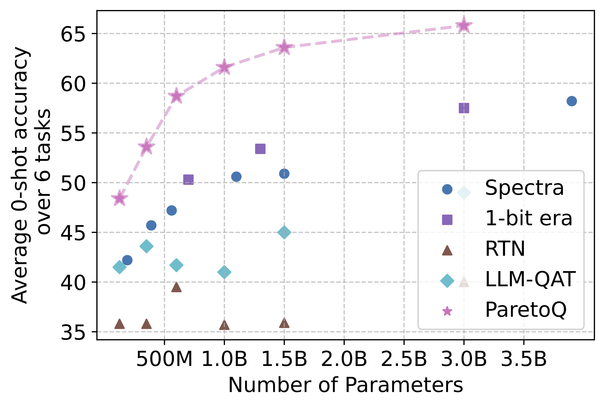

# ParetoQ

This repository contains the training code of ParetoQ introduced in our work: "[ParetoQ: Scaling Laws in Extremely Low-bit LLM Quantization](https://arxiv.org/abs/2502.02631)"

In this work, we present ParetoQ, the first unified framework that facilitates rigorous comparisons across 1-bit, 1.58-bit, 2-bit, 3-bit, and 4-bit quantization settings. By optimizing training schemes and refining quantization functions, ParetoQ surpasses all previous methods tailored to specific bit widths.  Specifically, the 1.58-bit ParetoQ LLaMA-3 8B model reduces the performance gap to full precision by relatively 37.8% compared to the 1-bit Era’s 1.58-bit LLaMA-3 8B model, while using only 30% of the training tokens.

With the SoTA points obtained through ParetoQ, we are able to improve the scaling law analysis. Figure (a) (b) demonstrates that sub-4-bit quantization, including binary, ternary, 2-bit, and 3-bit, often outperform 4-bit quantization. Notably, 2-bit and ternary models reside on the Pareto frontier. When considering hardware-friendliness and real-time speed, we generally recommend exploring 2-bit quantization for on-device applications.

## News
- May 28, 2024: 🚀 We made our 1-bit, 1.58-bit, 2-bit, 3-bit and 4-bit quantized MobileLLM models publicly available. [MobileLLM-ParetoQ]() We also release the MobileLLM-ParetoQ-BF16 models with the same structrue but trained on a more advanced data and achieves higher scores. The quantized MobileLLM models are all fine-tuned on top of MobileLLM-ParetoQ-BF16.

## Citation

If you find our code useful for your research, please consider citing:
    
    @article{liu2025paretoq,
      title={ParetoQ: Scaling Laws in Extremely Low-bit LLM Quantization},
      author={Liu, Zechun and Zhao, Changsheng and Huang, Hanxian and Chen, Sijia and Zhang, Jing and Zhao, Jiawei and Roy, Scott and Jin, Lisa and Xiong, Yunyang and Shi, Yangyang and others},
      journal={arXiv preprint arXiv:2502.02631},
      year={2025}
    }
    
## Run

### 1. Requirements:
* python 3.11
* pip3 install torch
* pip install -r requirement.txt
   
### 2. Steps to run:
* Specify the data path and the pre-trained full-precision model path in run_train.sh file
* Run `bash 1_run_train.sh $w_bit` E.g. `bash 1_run_train.sh 2` for 2-bit weight quantization.

## Comparison to SoTA Ternary LLM methods
The results reported in the paper is run with the internal LLaMA codebase in Meta. We reproduced our experiments with huggingface codebase and released code here. The results are close to those in the paper. 

 | Method | #Params | Arc-e | Arc-c | Boolq | Piqa | Siqa | HellaSwag | Obqa | WinoGrande | Avg. | Wiki |
 | --- | --- | --- | --- | --- | --- | --- | --- | --- | --- | --- | --- |
 | RTN | 600M | 26.2 | 24.6 | 62.2 | 49.5 | 36.3 | 26.1 | 27.1 | 48.8 | 37.6 | 6.60E+05 | 
 | LLM-QAT | 600M | 34.0 | 23.0 | 59.4 | 53.6 | 38.9 | 28.7 | 32.3 | 51.4 | 40.2 | 71.7 | 
 | 1-bit era | 700M | 49.5 | 29.0 | 59.2 | 67.5 | 43.6 | 43.2 | 38.9 | 53.5 | 48.1 | 17.3 | 
 | **ParetoQ** | **600M** | **65.5** | **43.8** | **62.3** | **70.6** | **44.7** | **51.3** | **47.1** | **58.8** | **55.5** | **11.4** |
 | RTN | 1B | 25.7 | 24.8 | 37.8 | 49.3 | 37.1 | 26.2 | 25.2 | 50.2 | 34.5 | 1.40E+05 | 
 | LLM-QAT | 1B | 36.0 | 26.2 | 47.7 | 55.1 | 39.7 | 31.3 | 33.5 | 49.6 | 39.9 | 56.9 | 
 | 1-bit era | 1.3B | 52.4 | 34.1 | 61.9 | 69.1 | 44.7 | 47.4 | 41.1 | 55.3 | 50.8 | 23.6 | 
 | **ParetoQ** | **1B** | **68.5** | **47.6** | **62.8** | **72.1** | **45.3** | **57.4** | **52.9** | **61.3** | **58.5** | **10.0** | 
 | RTN | 3B | 26.9 | 23.6 | 62.2 | 51.3 | 37.6 | 26.4 | 27.0 | 49.3 | 38.0 | 4.40E+05 | 
 | LLM-QAT | 3B | 44.5 | 30.7 | 62.1 | 62.7 | 41.0 | 43.4 | 35.0 | 50.6 | 46.3 | 6.50E+02 | 
 | 1-bit era | 3B | 58.7 | 37.2 | 61.3 | 71.3 | 45.2 | 56.0 | 45.8 | 60.3 | 54.5 | 265.6 | 
 | **ParetoQ**  | **3B** | **71.5** | **48.6** | **68.2** | **75.5** | **46.4** | **67.9** | **54.3** | **63.1** | **61.9** | **9.9** |

 More results for other bit widths can be found in the [paper](https://arxiv.org/abs/2502.02631).

## Model Release

 | [Method | Arc-e | Arc-c | Boolq | Piqa | Siqa | HellaSwag | Obqa | WinoGrande | Avg. | Wiki |
 | --- | --- | --- | --- | --- | --- | --- | --- | --- | --- | --- |
 | MobileLLM-ParetoQ-125M |
 | [MobileLLM-ParetoQ-125M-BF16](https://huggingface.co/facebook/MobileLLM-ParetoQ-125M-BF16) | 56 | 34.5 | 56.3 | 65.5 | 42 | 40.1 | 42.2 | 51.3 | 48.5 | 15.1 | 
 | [MobileLLM-ParetoQ-125M-1-bit](https://huggingface.co/facebook/MobileLLM-ParetoQ-125M-1-bit) | 43.9 | 29.1 | 61.2 | 59.2 | 39.8 | 29.8 | 33.7 | 52.7 | 43.7 | 25.8 | 
 | [MobileLLM-ParetoQ-125M-1.58-bit](https://huggingface.co/facebook/MobileLLM-ParetoQ-125M-1.58-bit) | 49.3 | 30.9 | 61 | 62.1 | 41 | 34.3 | 40.4 | 52.9 | 46.5 | 20 | 
 | [MobileLLM-ParetoQ-125M-2-bit](https://huggingface.co/facebook/MobileLLM-ParetoQ-125M-2-bit) | 50.7 | 32.7 | 59.8 | 63.3 | 41 | 36.3 | 40.6 | 52.7 | 47.1 | 18.2 | 
 | [MobileLLM-ParetoQ-125M-3-bit](https://huggingface.co/facebook/MobileLLM-ParetoQ-125M-3-bit) | 53.5 | 33.7 | 56.1 | 65.6 | 41.7 | 40 | 41.2 | 51.3 | 47.9 | 15 | 
 | [MobileLLM-ParetoQ-125M-4-bit](https://huggingface.co/facebook/MobileLLM-ParetoQ-125M-4-bit) | 55.4 | 35.2 | 54.1 | 66.2 | 41.7 | 40.8 | 44 | 52.1 | 48.7 | 14.1 | 
 | MobileLLM-ParetoQ-350M |
 | [MobileLLM-ParetoQ-350M-BF16](https://huggingface.co/facebook/MobileLLM-ParetoQ-350M-BF16) | 65.5 | 42.3 | 57.4 | 71 | 43.5 | 53.3 | 47.3 | 58.3 | 54.8 | 10.5 | 
 | [MobileLLM-ParetoQ-350M-1-bit](https://huggingface.co/facebook/MobileLLM-ParetoQ-350M-1-bit) | 52.7 | 31.3 | 61.6 | 63.9 | 40.9 | 38.3 | 39.5 | 52.9 | 47.6 | 17 | 
 | [MobileLLM-ParetoQ-350M-1.58-bit](https://huggingface.co/facebook/MobileLLM-ParetoQ-350M-1.58-bit) | 56.8 | 36.3 | 62.2 | 67.1 | 43.5 | 44 | 46.3 | 55.2 | 51.4 | 14.5 | 
 | [MobileLLM-ParetoQ-350M-2-bit](https://huggingface.co/facebook/MobileLLM-ParetoQ-350M-2-bit) | 59 | 39.4 | 63.5 | 68.8 | 43.1 | 47.3 | 44.1 | 57.5 | 52.8 | 12.5 | 
 | [MobileLLM-ParetoQ-350M-3-bit](https://huggingface.co/facebook/MobileLLM-ParetoQ-350M-3-bit) | 63.9 | 40.5 | 61.4 | 70.6 | 43.2 | 51.4 | 50 | 56.6 | 54.7 | 10.9 | 
 | [MobileLLM-ParetoQ-350M-4-bit](https://huggingface.co/facebook/MobileLLM-ParetoQ-350M-4-bit) | 64.9 | 41.6 | 57.8 | 71.3 | 44.4 | 53.5 | 48.2 | 57.9 | 55 | 10.3 | 
 | MobileLLM-ParetoQ-600M |
 | [MobileLLM-ParetoQ-600M-BF16](https://huggingface.co/facebook/MobileLLM-ParetoQ-600M-BF16) | 68.5 | 47.6 | 60.5 | 72.5 | 44.4 | 59.5 | 51.4 | 61.4 | 58.2 | 9.1 | 
 | [MobileLLM-ParetoQ-600M-1-bit](https://huggingface.co/facebook/MobileLLM-ParetoQ-600M-1-bit) | 58.9 | 36 | 60.5 | 65.2 | 43.1 | 44.2 | 40.7 | 53.9 | 50.3 | 14 | 
 | [MobileLLM-ParetoQ-600M-1.58-bit](https://huggingface.co/facebook/MobileLLM-ParetoQ-600M-1.58-bit) | 65.5 | 43.8 | 62.3 | 70.6 | 44.7 | 51.3 | 47.1 | 58.8 | 55.5 | 11.5 | 
 | [MobileLLM-ParetoQ-600M-2-bit](https://huggingface.co/facebook/MobileLLM-ParetoQ-600M-2-bit) | 67.7 | 43.3 | 63 | 72.1 | 44.8 | 53.9 | 49.8 | 58.4 | 56.6 | 10.5 | 
 | [MobileLLM-ParetoQ-600M-3-bit](https://huggingface.co/facebook/MobileLLM-ParetoQ-600M-3-bit) | 68.2 | 47.4 | 64.2 | 73.1 | 44.2 | 58.1 | 50.2 | 62.4 | 58.5 | 9.4 | 
 | [MobileLLM-ParetoQ-600M-4-bit](https://huggingface.co/facebook/MobileLLM-ParetoQ-600M-4-bit) | 69.3 | 48.9 | 64.8 | 73.2 | 44.2 | 59.5 | 51.2 | 62.1 | 59.2 | 8.9 | 
 | MobileLLM-ParetoQ-1B |
 | [MobileLLM-ParetoQ-1B-BF16](https://huggingface.co/facebook/MobileLLM-ParetoQ-1B-BF16) | 73.4 | 50.8 | 67.6 | 74.1 | 46.7 | 64.7 | 56.6 | 62.7 | 62.1 | 8 | 
 | [MobileLLM-ParetoQ-1B-1-bit](https://huggingface.co/facebook/MobileLLM-ParetoQ-1B-1-bit) | 62.6 | 40.2 | 62.1 | 69.5 | 42.8 | 49.5 | 48.8 | 54.9 | 53.8 | 12.8 | 
 | [MobileLLM-ParetoQ-1B-1.58-bit](https://huggingface.co/facebook/MobileLLM-ParetoQ-1B-1.58-bit) | 68.5 | 47.6 | 62.8 | 72.1 | 45.3 | 57.4 | 52.9 | 61.3 | 58.5 | 10 | 
 | [MobileLLM-ParetoQ-1B-2-bit](https://huggingface.co/facebook/MobileLLM-ParetoQ-1B-2-bit) | 73.3 | 49.3 | 65.7 | 74.2 | 45.9 | 60.3 | 57.4 | 61.6 | 61 | 9.2 | 
 | [MobileLLM-ParetoQ-1B-3-bit](https://huggingface.co/facebook/MobileLLM-ParetoQ-1B-3-bit) | 72.3 | 51.4 | 67 | 74.5 | 45.7 | 63.4 | 53.7 | 62.1 | 61.3 | 8.4 | 
 | [MobileLLM-ParetoQ-1B-4-bit](https://huggingface.co/facebook/MobileLLM-ParetoQ-1B-4-bit) | 74.7 | 52.1 | 67.9 | 74.8 | 46.9 | 64.8 | 56.2 | 62.1 | 62.5 | 7.9 | 
 | MobileLLM-ParetoQ-1.5B |
 | [MobileLLM-ParetoQ-1.5B-BF16](https://huggingface.co/facebook/MobileLLM-ParetoQ-1.5B-BF16) | 73.9 | 51.4 | 70 | 74.8 | 46.6 | 66.4 | 55.1 | 63.2 | 62.7 | 7.9 | 
 | [MobileLLM-ParetoQ-1.5B-1-bit](https://huggingface.co/facebook/MobileLLM-ParetoQ-1.5B-1-bit) | 67.9 | 42.4 | 63.4 | 70.2 | 44.5 | 54.2 | 47.4 | 57.6 | 55.9 | 11 | 
 | [MobileLLM-ParetoQ-1.5B-1.58-bit](https://huggingface.co/facebook/MobileLLM-ParetoQ-1.5B-1.58-bit) | 70.2 | 48 | 65.8 | 73.4 | 47.3 | 61.8 | 55.3 | 62.4 | 60.5 | 9 | 
 | [MobileLLM-ParetoQ-1.5B-2-bit](https://huggingface.co/facebook/MobileLLM-ParetoQ-1.5B-2-bit) | 73.3 | 47.5 | 70.1 | 74.1 | 46.8 | 64.6 | 55.5 | 62.5 | 61.8 | 8.3 | 
 | [MobileLLM-ParetoQ-1.5B-3-bit](https://huggingface.co/facebook/MobileLLM-ParetoQ-1.5B-3-bit) | 72.6 | 49.9 | 70.6 | 75.7 | 47.7 | 66 | 56.2 | 64.5 | 62.9 | 8 | 
 | [MobileLLM-ParetoQ-1.5B-4-bit](https://huggingface.co/facebook/MobileLLM-ParetoQ-1.5B-4-bit) | 74.4 | 51.7 | 71.8 | 75.3 | 47.3 | 67.2 | 57.6 | 63 | 63.6 | 7.6 | 

## Acknowledgement

This code is partially based on HuggingFace [Transformers](https://github.com/huggingface/transformers) repo under [Apache License](https://github.com/huggingface/transformers/blob/main/LICENSE).

## Contact

Zechun Liu, Reality Labs, Meta Inc (zechunliu at meta dot com)

Changsheng Zhao, Reality Labs, Meta Inc (cszhao at meta dot com)

## License

ParetoQ is released under the [BSD 3](https://github.com/facebookresearch/ParetoQ/blob/main/LICENSE) license.
